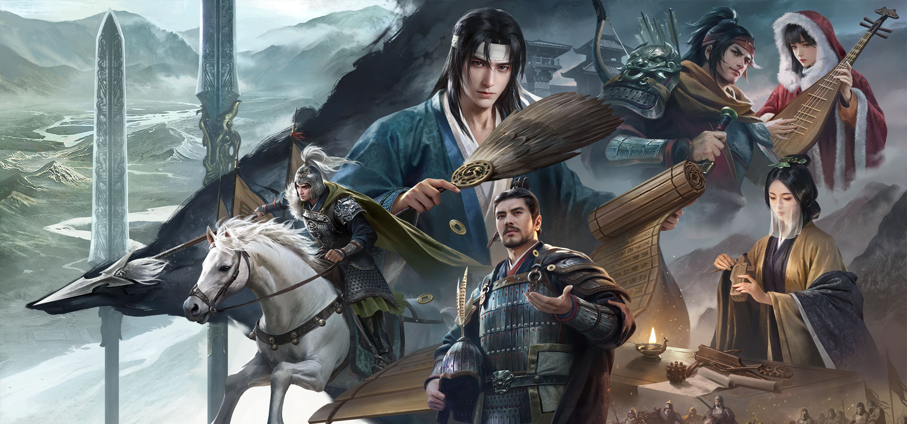

# ZHUGE

**介绍**

[三国：谋定天下](https://game.bilibili.com/nslg/gw/) 是一款 BiliBili 开发的三国题材SLG手游，具有一定的策略与趣味性。

本项目致力于构建一个基于*三国：谋定天下*游戏内容的 AI 配将助手 **诸葛**，基于LLM的零样本能力，根据玩家的*武将*和*战法*信息给出尽可能合理的配将方案。

**教程参考**

本项目基于*InternLM*教程构建，欢迎了解：[InternLM教程](https://github.com/InternLM/Tutorial/tree/camp3?tab=readme-ov-file)。

一起拥抱 LLM 的浪潮吧！

**模型特点**

- 风格模拟：根据央视版《三国演艺》诸葛亮的台词，模仿诸葛亮语言风格；
- 情景理解：模型可理解游戏情景，对武将和战法等特性具有一定的了解；
- 交互体验：模型具有较好的零样本能力，用户可以直接与模型进行问答交互。

**模型使用**

- 技术框架：base_model -> internlm2_chat_7b, 包括但不限于增量训练和 SFT；
- 部署环境：需在GPU环境运行，具体配置后期更新配置文档；
- 交互方式：用户可通过命令行或WebUI实现模型交互，并可以下载权重实现部署。

**注意事项**

[TODO]